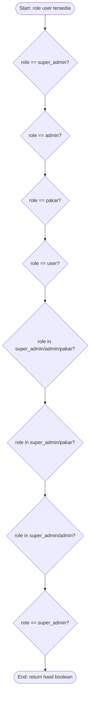
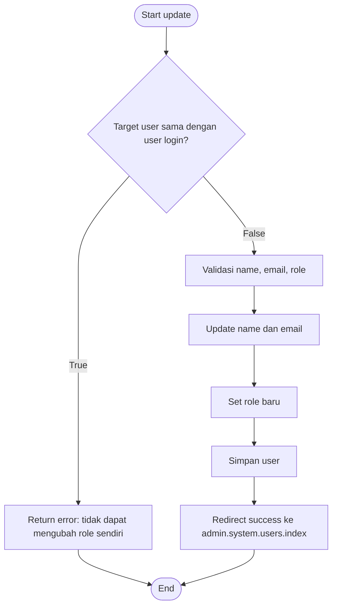
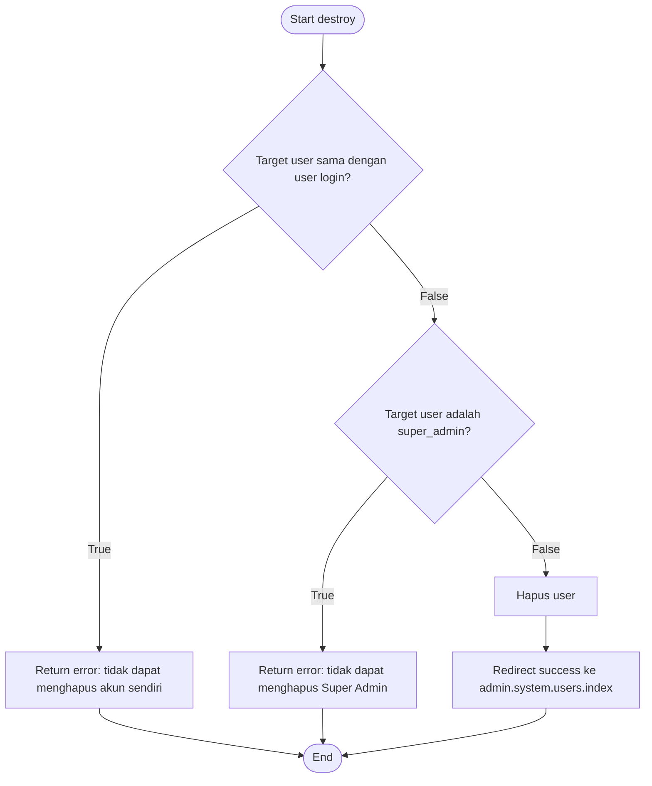
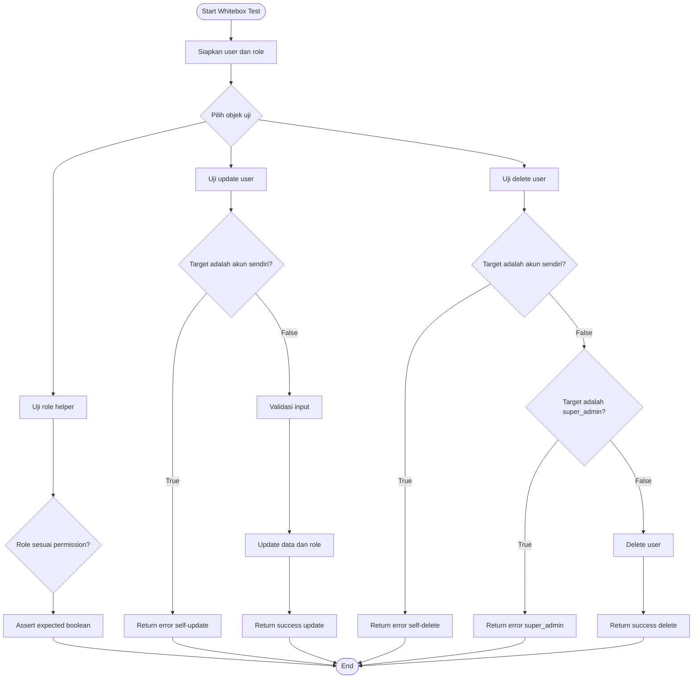

# Whitebox Testing CFG: Manajemen User dan Role

Dokumen ini menjelaskan pengujian whitebox untuk fitur manajemen user dan role pada project MAPAN. Fokus pengujian adalah struktur internal kode, terutama percabangan pada `UserManagementController` dan helper permission pada model `User`.

## Objek Pengujian

| Objek | File | Fokus |
|---|---|---|
| Role helper | `app/Models/User.php` | Mengecek role dan permission user |
| Update user | `app/Http/Controllers/Admin/UserManagementController.php` | Mencegah user mengubah role sendiri dan menguji update role user lain |
| Delete user | `app/Http/Controllers/Admin/UserManagementController.php` | Mencegah self-delete, mencegah hapus super admin, dan menguji delete user biasa |
| Test executable | `tests/Feature/Whitebox/UserWhiteboxTest.php` | Bukti test case berjalan di project |

## Ringkasan Metode

Whitebox testing melihat struktur kode program. Setiap proses dan percabangan dibuat menjadi node dalam Control Flow Graph (CFG).

Istilah yang digunakan:

| Istilah | Arti |
|---|---|
| Node | Titik proses atau keputusan dalam kode |
| Edge | Panah/alur dari satu node ke node lain |
| Decision node | Node percabangan, misalnya `if` |
| Independent path | Jalur unik yang harus diuji minimal satu kali |
| Cyclomatic Complexity | Jumlah jalur independen minimum yang perlu diuji |

Rumus yang digunakan:

```text
V(G) = E - N + 2
```

Keterangan:

```text
V(G) = Cyclomatic Complexity
E    = jumlah edge
N    = jumlah node
```

Rumus alternatif untuk kode tanpa loop kompleks:

```text
V(G) = jumlah decision + 1
```

---

## CFG 1: Role Helper pada Model User

### Kode yang Diuji

Helper role berada di `app/Models/User.php`:

```php
public function isSuperAdmin(): bool
{
    return $this->role === self::ROLE_SUPER_ADMIN;
}

public function isAdmin(): bool
{
    return $this->role === self::ROLE_ADMIN;
}

public function isPakar(): bool
{
    return $this->role === self::ROLE_PAKAR;
}

public function isUser(): bool
{
    return $this->role === self::ROLE_USER;
}

public function canManageKnowledgeBase(): bool
{
    return in_array($this->role, [
        self::ROLE_SUPER_ADMIN,
        self::ROLE_PAKAR,
    ]);
}

public function canManageSystem(): bool
{
    return in_array($this->role, [
        self::ROLE_SUPER_ADMIN,
        self::ROLE_ADMIN,
    ]);
}

public function canManageUsers(): bool
{
    return $this->role === self::ROLE_SUPER_ADMIN;
}
```

### Node

| Node | Deskripsi |
|---|---|
| R1 | Start: user memiliki nilai `role` |
| R2 | Cek `role === super_admin` |
| R3 | Cek `role === admin` |
| R4 | Cek `role === pakar` |
| R5 | Cek `role === user` |
| R6 | Cek role termasuk `[super_admin, admin, pakar]` untuk `isAtLeastAdmin()` |
| R7 | Cek role termasuk `[super_admin, pakar]` untuk `canManageKnowledgeBase()` |
| R8 | Cek role termasuk `[super_admin, admin]` untuk `canManageSystem()` |
| R9 | Cek `role === super_admin` untuk `canManageUsers()` |
| R10 | End: hasil boolean dikembalikan |

### Edge

```text
R1 -> R2 -> R3 -> R4 -> R5 -> R6 -> R7 -> R8 -> R9 -> R10
```

Setiap node decision menghasilkan nilai `true` atau `false`. Karena helper dipanggil untuk semua role utama, outcome `true` dan `false` dari setiap helper dapat diuji.

### Mermaid CFG



### Test Case Role Helper

| Test Case | Role | Tujuan |
|---|---|---|
| TC-R1 | `super_admin` | Menguji permission penuh, termasuk `canManageUsers = true` |
| TC-R2 | `admin` | Menguji akses sistem, tetapi tidak bisa kelola knowledge base dan user |
| TC-R3 | `pakar` | Menguji akses knowledge base, tetapi tidak bisa kelola sistem dan user |
| TC-R4 | `user` | Menguji role user biasa tanpa permission admin |

### Expected Result

| Role | isSuperAdmin | isAdmin | isPakar | isUser | isAtLeastAdmin | canManageKnowledgeBase | canManageSystem | canManageUsers |
|---|---:|---:|---:|---:|---:|---:|---:|---:|
| `super_admin` | true | false | false | false | true | true | true | true |
| `admin` | false | true | false | false | true | false | true | false |
| `pakar` | false | false | true | false | true | true | false | false |
| `user` | false | false | false | true | false | false | false | false |

---

## CFG 2: Update User Role

### Kode yang Diuji

```php
public function update(Request $request, User $user)
{
    if ($user->id === Auth::id()) {
        return redirect()->back()
            ->with('error', 'Anda tidak dapat mengubah role Anda sendiri.');
    }

    $validated = $request->validate([
        'name' => 'required|string|max:255',
        'email' => ['required', 'email', Rule::unique('users')->ignore($user->id)],
        'role' => ['required', Rule::in(User::ROLES)],
    ]);

    $user->update([
        'name' => $validated['name'],
        'email' => $validated['email'],
    ]);
    $user->role = $validated['role'];
    $user->save();

    return redirect()->route('admin.system.users.index')
        ->with('success', "User {$user->name} berhasil diperbarui.");
}
```

### Node

| Node | Deskripsi |
|---|---|
| U1 | Start method `update()` |
| U2 | Decision: apakah target user adalah akun yang sedang login? |
| U3 | Return error jika user mengubah role sendiri |
| U4 | Validasi input `name`, `email`, dan `role` |
| U5 | Update `name` dan `email` |
| U6 | Set role baru pada user |
| U7 | Simpan perubahan ke database |
| U8 | Return redirect success |
| U9 | End |

### Edge

```text
U1 -> U2
U2 -> U3 jika true
U2 -> U4 jika false
U3 -> U9
U4 -> U5 -> U6 -> U7 -> U8 -> U9
```

### Mermaid CFG



### Cyclomatic Complexity

Menggunakan rumus `V(G) = E - N + 2`:

```text
N = 9
E = 9
V(G) = 9 - 9 + 2 = 2
```

Menggunakan rumus decision:

```text
Jumlah decision = 1
V(G) = 1 + 1 = 2
```

Jadi minimal ada 2 independent path.

### Independent Path

| Path | Alur | Skenario |
|---|---|---|
| P-U1 | U1 -> U2 -> U3 -> U9 | User mencoba mengubah role dirinya sendiri |
| P-U2 | U1 -> U2 -> U4 -> U5 -> U6 -> U7 -> U8 -> U9 | Super admin mengubah data dan role user lain |

### Test Case Update User

| Test Case | Input/Skenario | Path | Expected Result |
|---|---|---|---|
| TC-U1 | Super admin mengirim request update ke akun sendiri | P-U1 | Redirect back dan session error `Anda tidak dapat mengubah role Anda sendiri.` |
| TC-U2 | Super admin mengubah user biasa menjadi admin | P-U2 | Data user berubah, role berubah, redirect success |

---

## CFG 3: Delete User

### Kode yang Diuji

```php
public function destroy(User $user)
{
    if ($user->id === Auth::id()) {
        return redirect()->back()
            ->with('error', 'Anda tidak dapat menghapus akun Anda sendiri.');
    }

    if ($user->isSuperAdmin()) {
        return redirect()->back()
            ->with('error', 'Tidak dapat menghapus akun Super Admin.');
    }

    $user->delete();

    return redirect()->route('admin.system.users.index')
        ->with('success', 'User berhasil dihapus.');
}
```

### Node

| Node | Deskripsi |
|---|---|
| D1 | Start method `destroy()` |
| D2 | Decision: apakah target user adalah akun yang sedang login? |
| D3 | Return error jika menghapus akun sendiri |
| D4 | Decision: apakah target user adalah super admin? |
| D5 | Return error jika target adalah super admin |
| D6 | Hapus user dari database |
| D7 | Return redirect success |
| D8 | End |

### Edge

```text
D1 -> D2
D2 -> D3 jika true
D2 -> D4 jika false
D3 -> D8
D4 -> D5 jika true
D4 -> D6 jika false
D5 -> D8
D6 -> D7
D7 -> D8
```

### Mermaid CFG



### Cyclomatic Complexity

Menggunakan rumus `V(G) = E - N + 2`:

```text
N = 8
E = 9
V(G) = 9 - 8 + 2 = 3
```

Menggunakan rumus decision:

```text
Jumlah decision = 2
V(G) = 2 + 1 = 3
```

Jadi minimal ada 3 independent path.

### Independent Path

| Path | Alur | Skenario |
|---|---|---|
| P-D1 | D1 -> D2 -> D3 -> D8 | Super admin mencoba menghapus akun sendiri |
| P-D2 | D1 -> D2 -> D4 -> D5 -> D8 | Super admin mencoba menghapus super admin lain |
| P-D3 | D1 -> D2 -> D4 -> D6 -> D7 -> D8 | Super admin menghapus user biasa |

### Test Case Delete User

| Test Case | Input/Skenario | Path | Expected Result |
|---|---|---|---|
| TC-D1 | Actor menghapus akun sendiri | P-D1 | User tidak terhapus dan session error `Anda tidak dapat menghapus akun Anda sendiri.` |
| TC-D2 | Actor menghapus target dengan role `super_admin` | P-D2 | User tidak terhapus dan session error `Tidak dapat menghapus akun Super Admin.` |
| TC-D3 | Actor menghapus target dengan role `user` | P-D3 | User terhapus dan redirect success |

---

## Gabungan CFG Manajemen User dan Role

Diagram berikut menggabungkan alur umum pengujian role, update user, dan delete user.



## Mapping ke File Test

Pengujian sudah tersedia di `tests/Feature/Whitebox/UserWhiteboxTest.php`.

| Area | Test di kode | CFG yang dicakup |
|---|---|---|
| Role helper | `covers User role helper decision outcomes for all roles` | CFG 1 |
| Update user | `covers UserManagementController update statements for blocked self role change and successful update` | CFG 2 |
| Delete user | `covers UserManagementController destroy decision branches` | CFG 3 |

## Perintah Menjalankan Test

Jalankan test whitebox saja:

```bash
php artisan test tests/Feature/Whitebox/UserWhiteboxTest.php
```

Jalankan seluruh test backend sesuai SOP project:

```bash
composer test
```

## Kesimpulan

Berdasarkan CFG:

| Objek | Jumlah Decision | Cyclomatic Complexity | Minimal Test Case |
|---|---:|---:|---:|
| Role helper | 8 helper boolean | 4 role utama untuk menutup outcome penting | 4 |
| Update user | 1 | 2 | 2 |
| Delete user | 2 | 3 | 3 |

Pengujian whitebox untuk manajemen user dan role memastikan:

- Role `super_admin`, `admin`, `pakar`, dan `user` menghasilkan permission yang benar.
- User tidak dapat mengubah role akunnya sendiri.
- User tidak dapat menghapus akunnya sendiri.
- Super admin lain tidak dapat dihapus.
- User biasa dapat dihapus oleh actor yang berwenang.
